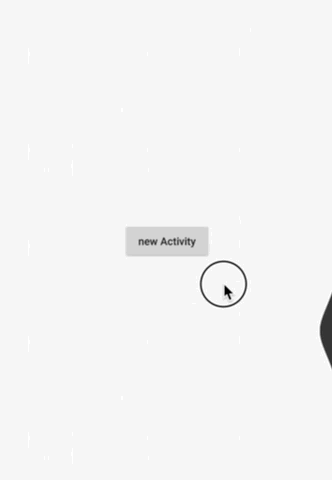

# Slide
一行代码实现滑动返回 前进

> 1、类似于“小米MIX”/“即刻App” 的这种全屏滑动返回 兼容性好，不易出错
> 
> 2、相比其他类似的侧滑返回的开源库 这个更扩具有扩展性，效率也相对高一些
> 
> 3、默认样式IDrawSlide 贝塞尔曲线高度模仿“即刻App”

#### Android 侧滑返回

```
//添加仓库地址
allprojects {
    repositories {
        ...
        maven { url "https://jitpack.io" }
    }
}

//引入库 注意last-version替换为最新版本号
dependencies {
        api 'com.github.ximencx:XMSlideControl:1.2'
}
	
```


* 简单使用

```java
@Override
protected void onCreate(Bundle savedInstanceState) {
    super.onCreate(savedInstanceState);
    
    setContent(xxxx);
    
    //开启滑动返回
        SlideManager.create(this).useDefaultSlideWidth()
                   .onSlide(new OnSlideListener() {
                       @Override
                       public void onSlideBack() {
                           Toast.makeText(DemoActivity.this, "onSlideBack", Toast.LENGTH_SHORT).show();
                           onBackPressed();
                       }

                       @Override
                       public void onSlideForward() {
                           Toast.makeText(DemoActivity.this, "onSlideForward", Toast.LENGTH_SHORT).show();
                           startActivity(new Intent(DemoActivity.this, DemoActivity.class));
                           overridePendingTransition(R.anim.fade_right_in, R.anim.fade_left_out);
                       }
                   }).useSlideBack().useSlideForward();
                   //监听滑动事件
                     @Override
                       public boolean onTouchEvent(MotionEvent event) {
                           return slideManager.onTouchEvent(event) || super.onTouchEvent(event);
                       }
}
```

* 其他说明
  1. SlideBack.canSlideWidth 设置左边沿触发开始的距离
  2. SlideBack.onSlide 设置触发返回的回调，不设置默认会调用当前Activity的onBackPressed
  

* 效果预览	[Demo Apk下载](https://github.com/qinci/AndroidSlideBack/raw/master/apk/demo.apk)

	
	
* TODO
	- [ ] 支持非Activity（如fragment）
	- [ ] 增加更多样式，


#### 其他
这个效果最早在小米MIX上看到的（系统级别滑动返回），一直想做一个来升级已有项目侧滑的方案，这个方案可以说完全不影响原来的效率。
这个之前我们的滑动返回方案是通过反射调用Activity的convertToTranslucent，然后代理监听隐藏接口TranslucentConversionListener，这种方案有一个缺点就是不能兼容低版本，再就是转成透明需要一定的时间。在更早之前也尝试过透明主题方案（程序效率相对会降低）和上一界面镜像显示方案（易出现黑屏）


**如果喜欢给个star呗**